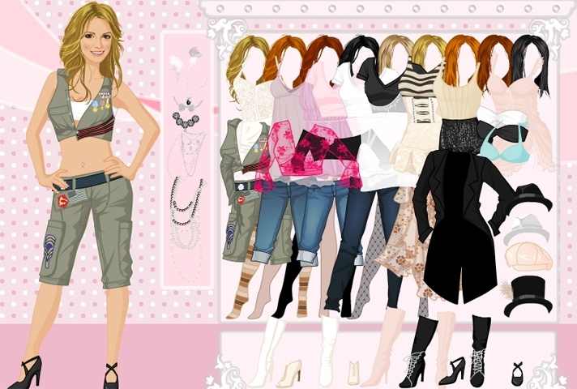

# Seminar 3 task

## Common tasks:

### 1. Isometric projection of a cube

https://en.wikipedia.org/wiki/Isometric_projection

* Learn what is isometric projection
* Draw isometric 3D-axis of different colors in the center of the screen
* Draw an axis-aligned unit cube in the center of origin
  * Remember what is a projection matrix and rotation matrix
  * https://en.wikipedia.org/wiki/Isometric_projection#Mathematics
* Add controls to rotate the cube along different axis on 10 degrees
* Enjoy your isometric projection :)

## Extra tasks:

For extra points, complete one of the following tasks. Either show that it works or create a pull request.

### 1. Small cartoon
* A background should be a picture loaded from file
* There should be a character that moves in a circle or sinusoid trajectory
* There should be some object the character interacts with
* Be creative :)

_Example: a dragon flies in a sinusoid-like trajectory and shoots fireballs._

### 2. Hangman
* Pick a word and let the player guess the letters (possibly with widgets)
* Add some element to a picture every time player picks a wrong letter.
* Show text "winner" if a player guesses the word. The text should be on picture and have some beautiful font. Don't use QLabel.

### 3. Geogebra (smol)
* Let the user pick type of graph (linear, quadratic, cubic, etc), e. g. with a ComboBox
* Let the user input coefficients for the chosen graph
* Plot it!
* Bonus for additional geogebra-like functions (e. g. plot multiple graphs or choose their color)

### 4. Hot Britney Spears Dress Up Game

* There should be some main object or character on the scene
* There should be some objects that the user can drag around and dress up the character
* Hint: there are events like `dragEnterEvent`

